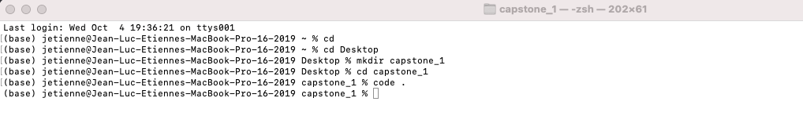

#Setup

Okay let's do that create our project folder

Cd (Change directory into your project folder)
$ cd
$ cd Desktop

Let's create the folder
$ mkdir capstone_1

Enter the folder
$ cd capstone_1

Okay let's open VS Code. Don't forget the period!
$ code .

Let's create a new file called test.py Cool run it.

Nice it works!

Cool let's set this virtual environment up.

You get this pop up might as well press yes. It activates the virtual environment automatically

Into the vs code terminal we go
$ virtualenv -p python3 venv

Maybe yours activates the virtual (venv) automatically. If it doesn't just use this
$ . venv/bin/activate

Check the front it says venv.

Congrats you are set up.
